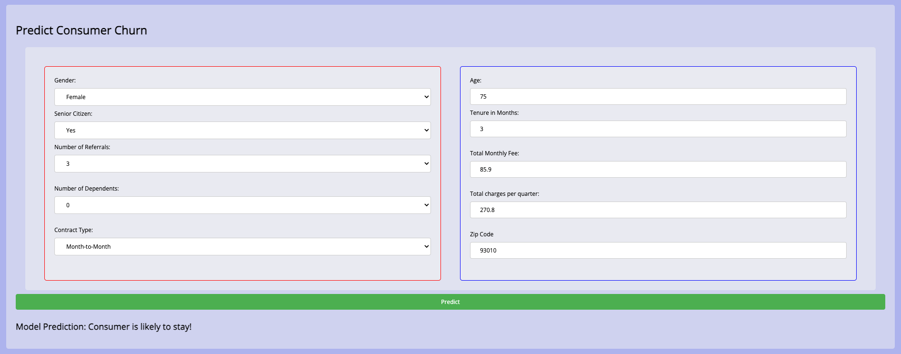

# Team 9 (Wan & Siva)

### Public URL here: http://13.229.196.59/

----------
**Catboost Classifer** model is choosen based on accuracy! 

Kept to the minimum possible values to get best/optimum outcome. This allows user to input required data easily in front-end! 

```python
[['gender','age','senior_citizen','num_dependents','zip_code','tenure_months','num_referrals','total_monthly_fee','total_charges_quarter','contract_type','churn_label']]
```

Kfold is used. In 9 folds, AUC ranges between 0.88 to 0.90
AUC: 0.8854




## AI300 Capstone Grading

### Feedback from Instructor Min Yan

Great work, Siva and Wan Xiang! Glad to see that you've managed to achieve an AUC of close to 0.9, which is on the higher end, even after feature selection :)

Since you both have challenged yourselves to go above and beyond, I'd like to encourage you to think about further areas of improvement:

- Great use of `load_dotenv()` in your notebook. If you're planning to store database credentials in a separate `.env` file, I'd strongly encourage to also keep your `ENDPOINT`, `PORT` and `USERNAME` credentials secret as well. This would be the recommended practice, to minimise the chances of a successful brute force attack by malicious attackers!

- I was heartened to see that your team explored using id tags `#left` and `#right` to style particular elements through your .css file! I like the side-by-side layout to make the form wider rather than longer, but do keep in mind to use colors carefully! The use of the blue and red boxes may cause confusion for users using your form for a first time, so you might need to clarify its purpose on the UI for first-time visitors as well.

- I read in the last cell of your research notebook that you were struggling with an error, which is now commented out. Hint from the error message: check out the data type of what the `churn_label` column would become after that cell, and what is the usual data types expected by a classifier model for the label column.

- Notice your team had used a `.gitignore` file for your `.DS_Store` file, but you might realise it currently still exists on your main branch - [this StackOverflow post](https://stackoverflow.com/questions/7927230/remove-directory-from-remote-repository-after-adding-them-to-gitignore) might help to clarify why. In short, you had previously already pushed this file to remote which caused it to be tracked, hence to undo this you need to run these commands:
```bash
git rm --cached .DS_Store  # run in project root directory
git commit -m 'Remove the now ignored file .DS_Store'
git push
```
p.s. there's a random empty file titled "Wan Xiang" in your main branch, you might want to remove that as well

Feel free to reach out if you need further clarification. Wishing you both the best for your future endeavours!


### Total Score: 20 / 20

Data Exploration: 6 / 6 marks
- [x] SQL used to successfully retrieve dataset from remote Heicoders database
- [x] SQL query should retrieve at least one column from each table:
churn_status, account, account_usage, customer and city tables
- [x] At least 2 charts used to visualise columns in dataset (e.g. with matplotlib or plotly)
- [x] Evidence of data preprocessing and/or feature engineering
e.g. column data type conversions, handling missing values, one hot encoding, etc.

Model Selection: 5 / 5 marks
- [x] Experiment with at least 2 model algorithms (e.g. catboost, xgboost, lgbm)
- [x] Evidence of hyperparameter tuning (e.g. GridSearchCV, RandomizedSearchCV, etc)
- [x] Calculate offline AUC of selected model
- [x] Export selected final model to .pkl file using joblib library

Remote GitHub Repository: 4 / 4 marks
- [x] Evidence of multiple commits with meaningful commit messages
- [x] Contains latest code for research notebook & Flask web app
- [x] Contains required documentation specified in grading rubric

Flask Web Application: 5 / 5 marks
- [x] Implement Model() class that loads model from .pkl file and generate predictions
- [x] Web app should support functionality of generating binary predictions
- [x] Web app is hosted on a publicly accessible website
